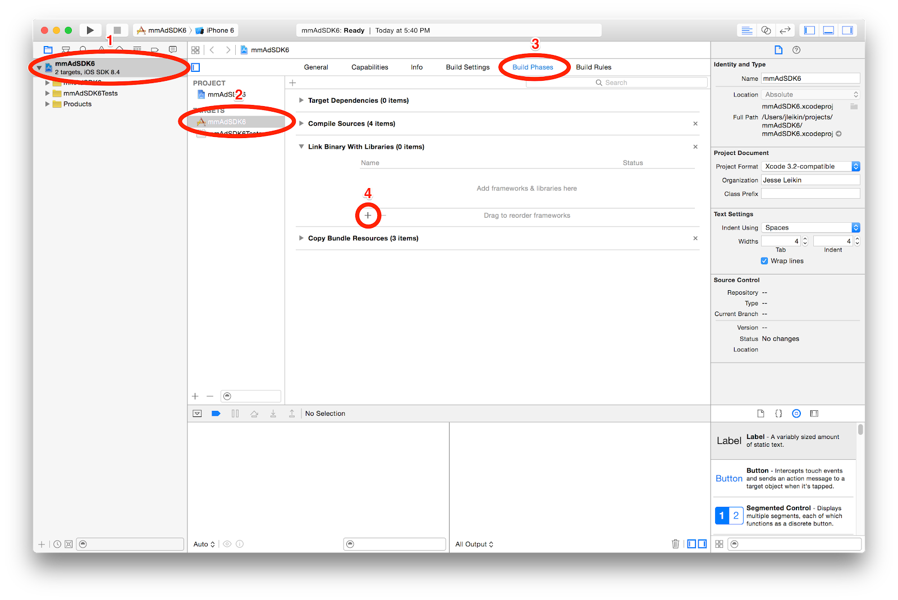

## Version
iOS -> v0.1.2

## Getting Started

Start by downloading the client [SDK](https://github.com/Serind/PocketID/releases/tag/v0.1.2-iOS-alpha).

Once you have the client SDK, you’re ready to integrate it with your (d)App.

1. Copy the PocketID.framework file into your Xcode project directory.
1. Select your project in the left pane of Xcode (the blue one), select your app target under "general", under "Embed Binaries", click the +, choose other and browse to the PocketID.framework file you copied earlier.
1. Import PocketID in your code.

 

## Initialization

PocketID requires this mandatory step in order to 
initialize the sdk before any of its features can be used. 
You will find the class `PocketID` is the main source of your interaction with the sdk. 
To initialize the SDK, you’ll need to call `PocketID.initialize(“APP_ID”)` in your AppDelegate’s `didFinishLaunchingWithOptions` method and pass in your AppID.

> In development environment use this sample AppID: 
> `nh(DyBAlOlVWugK_ezmqN!qEHBiKYVF)` 
> For production, please contact us to generate a prod AppID

 

## Delegate

Most of the SDK functionality will have associated events that will be called to notify you of progress and results. 
To listen for these events, you may make your controller extend the `PocketIDDelegate` and assign that controller to `PocketID.shared().deleagte = myViewController` in your controller’s `viewDidLoad()` method.

 

## Customization
   
We understand every application is unique with it’s own design and functional needs. PocketID sdk provides the necessary tools for customization. 
On iOS, `PocketID.customize()` is the main source of sdk customization. You can pass several optional parameters to that method to customize your experience.
For a full list of supported customization, please see the [Reference](#reference).

 

## Login/Registration (Button)

The easiest and recommended way to initiate the login/registration process is through our dedicated ‘Login with PocketID’ button. 
This is a great way to onboard both users who are new to your (d)App or users who may already have a PocketID account. 
All that’s needed is to add a `UIView` to your Storyboard or Xib layout file and assign it’s class to `PIDLoginView`. 
The login button will render instantly in your Storyboard or Xib layout.

 

## Login/Registration (Manual)

PocketID integration makes it very simple for your users to adopt blockchain without having the need or the pressure to fully understand it. 
Your users will appreciate when your onboarding process is similar to what they are already used to, ie username and password. 
All that is needed is to call `PocketID.login(loginType: PIDLoginType)` and our client sdk will handle all the detailed work needed to generate an account.

Pass `.Login` or `.Register` for the parameter `loginType` if you want the initial screen to default to the Login or Registration flow.

* After login, the SDK will call the delegate method `func loginSuccessful()`  
* After registration, the SDK will call the delegate method `func registrationSuccessful()`

> The end result will be a logged-in user

 

## User

After the user has logged in, you can get the account detail by calling `PocketID.user()` which will return a `PIDUser` object via the `onCompletion` callback parameter.

 

## SSO (single sign-on)

Just like the major single sign-on platforms such as Facebook and Google, our login/onboarding process is meant to make it very easy and convenient for users to login to your app. 
The great aspect of SSO is that the user don’t have to re-login to your app every time and as a side benefit, user’s don’t need to login to other apps that support PocketID as well. 
This creates a level of comfort for users and will create a sphere of convenience. 
As a developer, you don’t have to do anything extra to enable this feature, it works by default on the respective platform.

 

## Logout

The logged-in user will have a stored session in the client SDK. In order to log the user out, just call `PocketID.logout()`. 
This will clear the session from the sdk and `PocketID.isLoggedIn()` will return `false`.

After logging out, the SDK will call the delegate method `func loggedOut()`.

> Note that if the user is not logged in, `PocketID.user()` will return `null`.

 

## Forgot Password

PocketID client SDK’s onboarding process comes built-in with forgot and reset password feature. 
This process have been simplified and is very seamless as the user will not have to go outside of the app at all to reset their password. 
This flow is built-in to the login process therefore the developer don’t have to do anything extra to support this feature. 

> Note that the end result of forgot/reset password will be a logged-in user after successful reset.

 

## Reference
 

#### PocketID

Main interactions with the sdk is through this class. Used as Singleton.

* `initialize()`
    * Validates the state of the sdk
    * If User is already logged in on the device, will set state to logged in
* `isLoggedIn()`
    * True or False
* `customize()`
    * Customize the SDK
* `login()`
    * Manually triggers the Login Flow
    * `loginType` parameter will start the flow with either the login or registration screen
* `logout()`
    * Logs out the current user and clears the global session
* `user()`
    * Returns an instance of the current logged in user

 

#### Protocol PocketID Delegate

Methods that get called when events happen in the SDK

* `loginSuccessful()`
* `registrationSuccessful()`
* `loggedOut()`

 

#### Class PIDUSer

Contains information about the logged in user

* `username`
* `countryCode`
* `phoneNumber`
* `emailAddress`

 